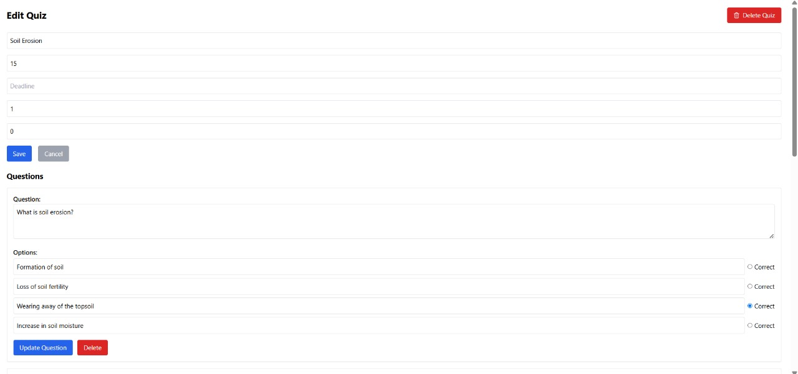
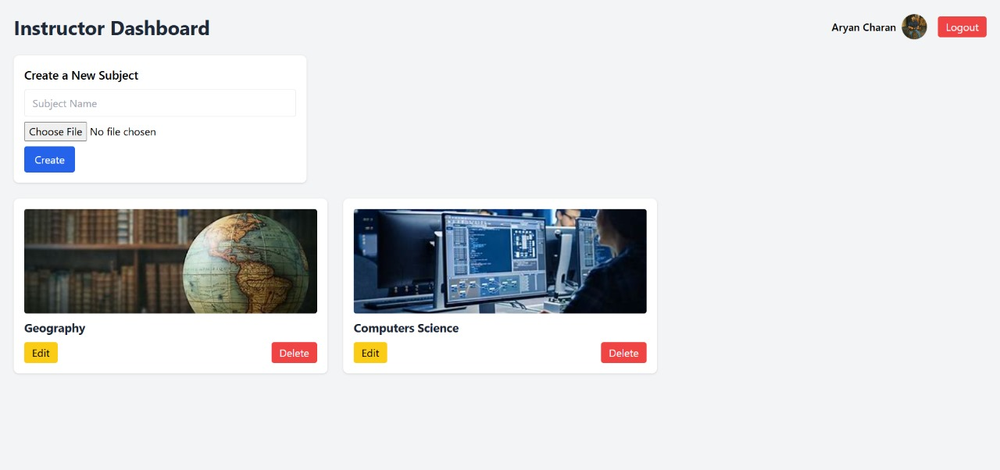
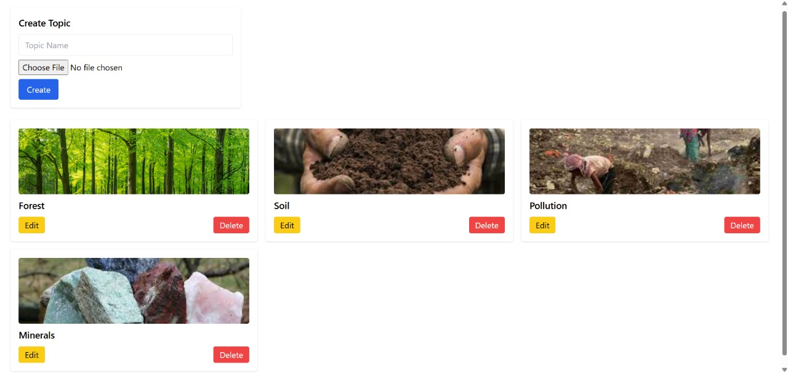
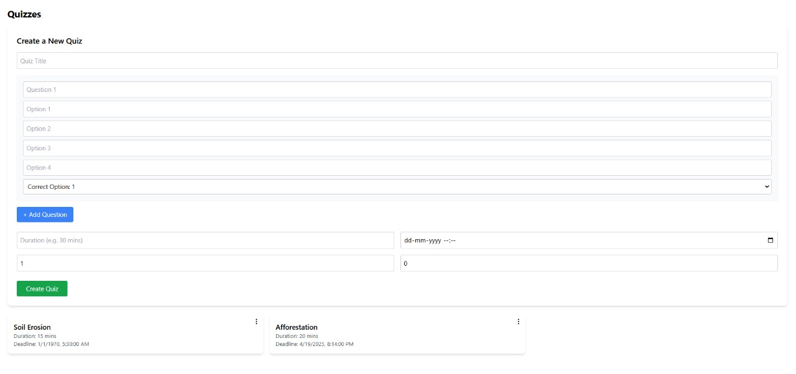
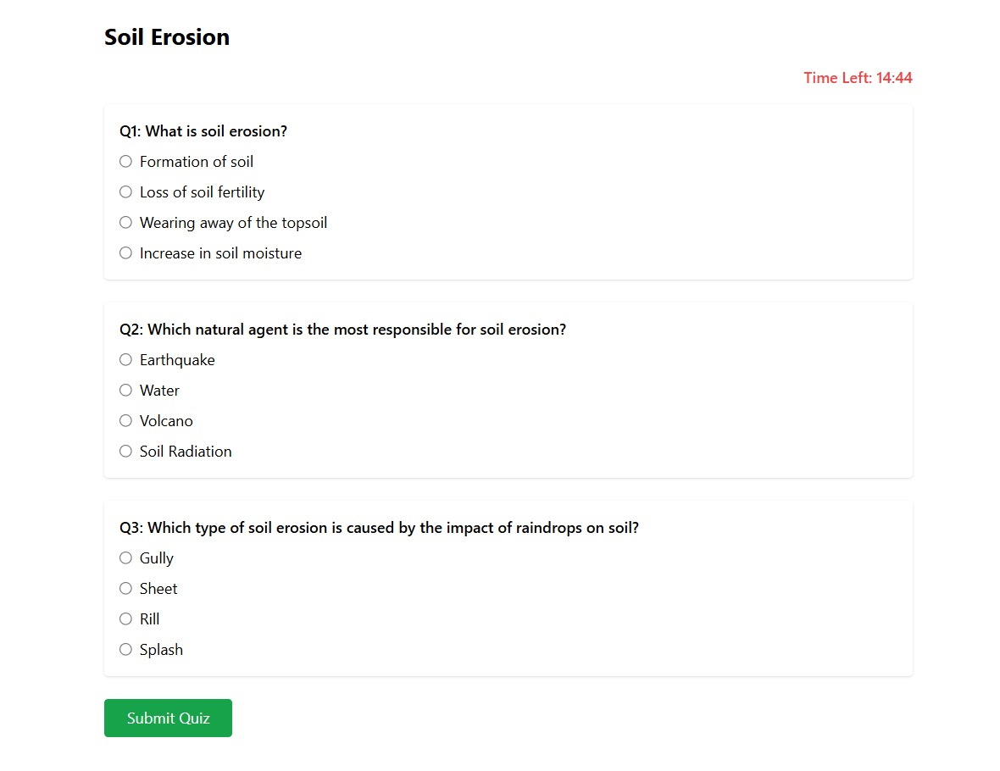
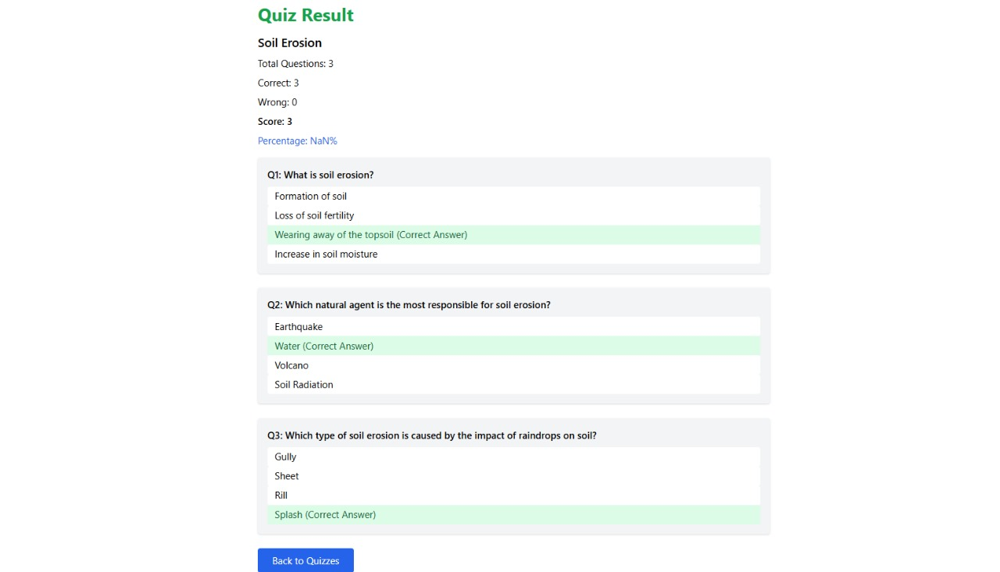
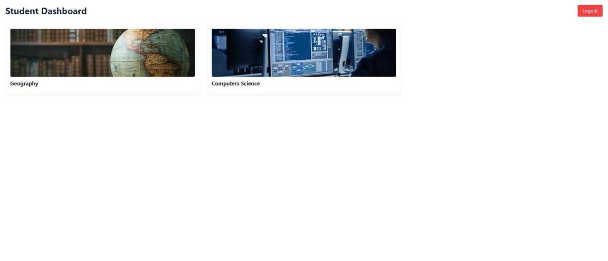
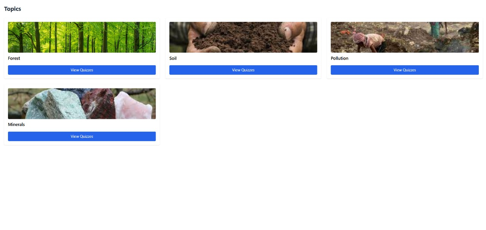

# Quiz Master

This project is an educational quiz platform designed to track student learning through subjects, topics, and quizzes. Instructors can create and manage quizzes, while students can attempt quizzes and view detailed analytics.

## Table of Contents

1. [Project Overview](#project-overview)
2. [Project Structure](#project-structure)
3. [Setup Instructions](#setup-instructions)
4. [Running the Application](#running-the-application)
5. [API Endpoints](#api-endpoints)
6. [Frontend Components](#frontend-components)
7. [Styling](#styling)
8. [Testing](#testing)
9. [License](#license)

## Project Overview

Quiz Master is an interactive quiz application for students and instructors. Instructors can create subjects, topics, and quizzes with detailed questions, and students can attempt quizzes, view scores, and analyze performance using graphs and reports. The system includes role-based dashboards, real-time score tracking, and result email notifications.

## Project Structure

QuizMaster/
│
├── backend/
│   ├── config/
│   │   └── db.js
│   ├── controllers/
│   │   ├── studentController.js
│   │   ├── subjectController.js
│   │   ├── topicController.js
│   │   ├── quizController.js
│   ├── middleware/
│   │   └── upload.js
│   ├── models/
│   │   ├── StudentProfile.js
│   │   ├── InstructorProfile.js
│   │   ├── Subject.js
│   │   ├── Topic.js
│   │   ├── Quiz.js
│   │   └── User.js
│   ├── routes/
│   │   ├── instructorRoutes.js
│   │   ├── studentRoutes.js
│   │   ├── subjectRoutes.js
│   │   ├── topicRoutes.js
│   │   ├── quizRoutes.js
│   │   └── userRoutes.js
│   ├── uploads/
│   ├── .env
│   └── index.js
│   ├── package-lock.json
│   └── package.json
│
├── frontend/
│   ├── src/
│   │   ├── pages/
│   │   │   ├── InstructorDashboard.jsx
│   │   │   ├── Login.jsx
│   │   │   ├── Register.jsx
│   │   │   ├── StudentDashboard.jsx
│   │   │   ├── StudentSubjectPage.jsx
│   │   │   ├── StudentTopicPage.jsx
│   │   │   ├── QuizAttemptPage.jsx
│   │   │   ├── QuizResultPage.jsx
│   │   │   ├── QuizPage.jsx
│   │   │   └── TopicPages.jsx
│   │   │   └── SubjectPages.jsx
│   │   ├── components/
│   │   │   ├── Profile/
│   │   │   │   ├──InstructorProfileForm.jsx
│   │   │   │   ├──StudentProfileForm.jsx
│   │   │   ├── Quiz/
│   │   │   │   ├──EditQuizModal.jsx
│   │   │   │   ├──QuestionForm.jsx
│   │   │   │   ├──QuizCard.jsx
│   │   │   │   ├──QuizForm.jsx
│   │   │   ├── Subject/
│   │   │   │   ├──SubjectCard.jsx
│   │   │   │   ├──SubjectForm.jsx
│   │   │   ├── Topic/
│   │   │   │   ├──TopicCard.jsx
│   │   │   │   ├──TopicForm.jsx
│   ├── package-lock.json
│   └── package.json

## Screenshots

### Prerequisites

- Node.js (v14 or higher)
- MongoDB (local installation or MongoDB Atlas)
- npm (v6 or higher)

## Setup Instructions

### Prerequisites

- Node.js (v14 or higher)
- MongoDB (local installation or MongoDB Atlas)
- npm (v6 or higher)

### Backend Setup

1. Navigate to the backend directory:

    sh
    cd backend
    
2. Install the required dependencies:

    sh
    npm install
    
3. Create a .env file in the backend directory with the following content:

    plaintext
    MONGODB_URI=mongodb://0.0.0.0/backend
    
4. Start the backend server:

    sh
    npm run dev
    
### Frontend Setup

1. Navigate to the frontend directory:

    sh
    cd frontend
    
2. Install the required dependencies:

    sh
    npm install
    
3. Start the frontend development server:

    sh
    npm run dev

## Running the Application

1. Ensure MongoDB is running locally or that you have a valid connection string for MongoDB Atlas.
2. Start the backend server by running npm run dev in the backend directory.
3. Start the frontend server by running npm run dev in the frontend directory.
4. Open your browser and navigate to http://localhost:5000 to view the application.

## API Endpoints

### User Registration

- *Endpoint*: /api/users/register
- *Method*: POST
- *Description*: Registers a new user.
- *Request Body*:
    json
    {
        "fullName": "Ram Raj",
        "email": "Ram.Raj@example.com",
        "password": "password123"
    }
    
### User Login

- *Endpoint*: /api/users/login
- *Method*: POST
- *Description*: Authenticates a user.
- *Request Body*:
    json
    {
        "email": "Ram.Raj@example.com",
        "password": "password123"
    }
    
### Instructor's Dashboard

- *Endpoint*: /api/instructor/profile/${userId}
- *Method*: GET
- *Description*: Fetches the profile of thr instructor.
- *Request Body*:
    json
    {
        "email": "instructor@gmail.com"
        _id: 67f3ffdf6f919a70946532fd
    }

### Creating Subjects
- *Endpoint*: /api/instructor/subject
- *Method*: POST
- *Description*: craetes the new subject
- *Request Body*:
    json
    {
        "name" :"Computer Science"
        "image" : "uploads\1745076176661-Computer.jpg"
    }
    
### Editing Subjects
- *Endpoint*: /api/instructor/subject/${editingSubject._id}
- *Method*: PUT
- *Description*: helps editing the subject
- *Request Body*:
    json
    {
        "name" :"Computer Science"
        "image" : "uploads\1745076176661-Computer.jpg"
    }

### Creating Topics inside the subject
- *Endpoint*: /api/topics
- *Method*: POST
- *Description*: craetes the new topic
- *Request Body*:
    json
    {
        "name" :"Artificial Intelligence"
        "image" : "uploads\1745076176661-AI.jpg"
    }
    
### Editing Topic
- *Endpoint*: /api/topics/${editingTopic._id}
- *Method*: PUT
- *Description*: helps editing the topics
- *Request Body*:
    json
    {
        "name" :"Artificial Intelligence"
        "image" : "uploads\1745076176661-AI.jpg"
    }
    
### Creating Quiz inside the topic
- *Endpoint*: /api/quizzes
- *Method*: POST
- *Description*: craetes the new quiz
- *Request Body*:
    json
    {
        "name" : "Defforestation"
    }

### Student's Dashboard

- *Endpoint*: /api/student/profile/${userId}
- *Method*: GET
- *Description*: Fetches the profile of thr student
- *Request Body*:
    json
    {
        "email": "charanaryan08@gmail.com"
        _id: 67f3ffdf6f919a70946532fd
    }

### Subjects for student side
- *Endpoint*: /api/subjects
- *Method*: GET
- *Description*: Fetches
- *Request Body*:
    json
    {
        "name" :"Computer Science"
        "image" : "uploads\1745076176661-Computer.jpg"
    }

### Topics for student side
- *Endpoint*: api/topics/${subjectId}
- *Method*: GET
- *Description*: Fetches the topic
- *Request Body*:
    json
    {
        "name" :"Artificial Intelligence"
        "image" : "uploads\1745076176661-AI.jpg"
    }
    
### Quiz for Student side
- *Endpoint*: api/quizzes
- *Method*: GET
- *Description*: fetches the quiz created by the instructor
- *Request Body*:
    json
    {
        "name" :"Soil Erosion"
    }
    
## Frontend Components

### Login Page
*File*: frontend/src/pages/Login.jsx
*Description*: Renders the login form and handles Firebase authentication for both students and instructors.

### Register Page
*File*: frontend/src/pages/Register.jsx
*Description*: Renders the signup form and registers users with Firebase, followed by user creation in the backend database.

### Instructor Dashboard
*File*: frontend/src/pages/InstructorDashboard.jsx
*Description*: Displays all subjects created by the instructor. Allows subject creation, editing, and deletion.

### Subject Page (Instructor)
*File*: frontend/src/pages/SubjectPage.jsx
*Description*: Lists all topics under a specific subject. Allows topic creation, editing, and deletion.

### Topic Page (Instructor)
*File*: frontend/src/pages/TopicPage.jsx
*Description*: Lists all quizzes under a specific topic. Instructors can create, edit, or delete quizzes.

### Quiz Page (Instructor)
*File*: frontend/src/pages/QuizPage.jsx
*Description*: Displays quiz details and allows instructors to view and manage individual quiz questions.

### Edit Quiz Form
*File*: frontend/src/components/Quiz/EditQuizModal.jsx
*Description*: A modal/form for editing quiz information and questions.

### Student Dashboard
*File*: frontend/src/pages/StudentDashboard.jsx
*Description*: Displays all subjects available to the student, as created by instructors.

### Student Subject Page
*File*: frontend/src/pages/StudentSubjectPage.jsx
*Description*: Displays all topics under the selected subject for students.

### Student Topic Page
*File*: frontend/src/pages/StudentTopicPage.jsx
*Description*: Lists all quizzes under a topic. Students can view quiz details and start attempts.

### Quiz Attempt Page
*File*: frontend/src/pages/QuizAttemptPage.jsx
*Description*: Interface for students to attempt quizzes, displaying one question at a time with multiple options.

### Quiz Result Page
*File*: frontend/src/pages/QuizResultPage.jsx
*Description*: Displays the quiz result after submission, including score, correct/incorrect breakdown, and performance analysis.

### SubjectCard Component
*File*: frontend/src/components/Subject/SubjectCard.jsx
*Description*: Card component used to display a subject in both instructor and student dashboards.

### SubjectForm Component
*File*: frontend/src/components/Subject/SubjectForm.jsx
*Description*: Modal/form to create or edit a subject.

### TopicCard Component
*File*: frontend/src/components/Topic/TopicCard.jsx
*Description*: Displays a topic and provides navigation or management actions.

### TopicForm Component
*File*: frontend/src/components/Topic/TopicForm.jsx
*Description*: Modal/form to create or edit a topic.

### QuizCard Component
*File*: frontend/src/components/Quiz/QuizCard.jsx
*Description*: Displays quiz details like title, deadline, and marks. Varies UI for students and instructors.

### QuizForm Component
*File*: frontend/src/components/Quiz/QuizForm.jsx
*Description*: Modal/form to create a new quiz with title, questions, marks, and timing.

### QuestionForm Component
*File*: frontend/src/components/Quiz/QuestionForm.jsx
*Description*: Used within quiz forms to add or edit individual quiz questions.

### AuthContext
*File*: frontend/src/context/AuthContext.jsx
*Description*: Provides authentication state (Firebase + MongoDB user) across the app.

### App Routing
*File*: frontend/src/App.jsx
*Description*: Main routing configuration using React Router, defining paths for public, instructor, and student views.

## Backend Components

### Firebase Authentication Integration
*File(s)*: backend/middleware/authMiddleware.js
*Description*: Middleware that verifies Firebase ID tokens from frontend requests to protect private routes.

### User Model
*File*: backend/models/userModel.js
*Description*: Mongoose schema defining user structure, including Firebase UID, name, email, and role (student/instructor).

### User Routes
*File*: backend/routes/userRoutes.js
*Description*: Defines routes to get user data from MongoDB using Firebase UID.

### User Controller
*File*: backend/controllers/userController.js
*Description*: Handles logic to fetch user data from the database using UID.

### Subject Model
*File*: backend/models/subjectModel.js
*Description*: Mongoose schema for subjects. Each subject has a name, photo, and is linked to an instructor.

### Subject Routes
*File*: backend/routes/subjectRoutes.js
*Description*: API routes to create, update, delete, and get subjects by instructor or for all users.

### Subject Controller
*File*: backend/controllers/subjectController.js
*Description*: Handles logic for CRUD operations on subjects and filtering them by user role.

### Topic Model
*File*: backend/models/topicModel.js
*Description*: Mongoose schema for topics. Each topic is linked to a subject and an instructor.

### Topic Routes
*File*: backend/routes/topicRoutes.js
*Description*: API routes to create, update, delete, and fetch topics based on subject ID.

### Topic Controller
*File*: backend/controllers/topicController.js
*Description*: Contains logic for topic CRUD operations and filtering topics by subject.

### Quiz Model
*File*: backend/models/quizModel.js
*Description*: Mongoose schema for quizzes. Includes quiz title, duration, deadline, marks, and an array of questions.

### Quiz Routes
*File*: backend/routes/quizRoutes.js
*Description*: Routes to create, update, delete, and fetch quizzes, as well as specific quiz data.

### Quiz Controller
*File*: backend/controllers/quizController.js
*Description*: Handles quiz logic like creating quizzes with questions, fetching quiz by ID, and updating questions.

### MongoDB Connection
*File*: backend/config/db.js
*Description*: Sets up the MongoDB connection using Mongoose.

### Server Entry Point
*File*: backend/server.js
*Description*: Main entry point of the backend. Sets up Express server, middleware, API routes, and database connection.

## Styling
*Framework*: Tailwind CSS  
*Description*: The application uses Tailwind CSS for styling components. All layout, spacing, color, and responsive design is handled via utility classes directly in JSX. Components maintain consistent styling using Tailwind's utility-first approach.

## Testing
*Current Status*: Manual Testing  
*Description*: Basic functionality has been tested manually through user flows including login, signup, dashboard navigation, quiz creation, and quiz attempts. Automated testing (e.g., Jest, Cypress) is not currently integrated but is planned for future development.

## License
*Type*: MIT License  
*Description*: This project is licensed under the MIT License. You are free to use, modify, and distribute this software with attribution and without warranty. See the LICENSE file for more details.
